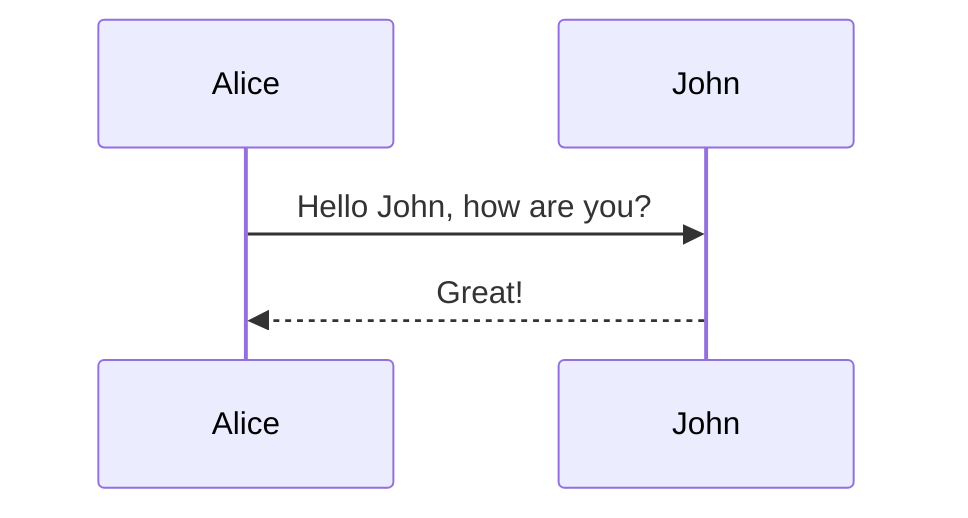

# Beautiful Mermaid - Mermaid plugin for Typst

[Mermaid](https://mermaid.js.org/) rendered using [beautiful-mermaid](https://github.com/lukilabs/beautiful-mermaid).

Typst package for drawing diagrams from markup using Mermaid.

> [!NOTE]
> This currently doesn't render the diagrams correctly since `beautiful-mermaid` uses CSS variables for styling instead of embedding the styles in the SVG.
> Check [this PR](https://github.com/lukilabs/beautiful-mermaid/pull/31) for more details.

## Why beautiful-mermaid?

This plugin runs a JavaScript engine (`quickjs`) inside a WebAssembly environment to render Mermaid diagrams during the Typst compilation process. We use `beautiful-mermaid` because it provides an ultra-fast, DOM-independent NodeJS library for rendering Mermaid diagrams to SVG, which is perfectly suited for a WASM environment.

## Limitations

Because this plugin runs a JavaScript engine (`quickjs`) inside a WebAssembly environment, it won’t be quite as snappy as a pure native rendering engine. However, the use of `beautiful-mermaid` minimizes the overhead significantly.

## Features

Supports most Mermaid diagram types, including:

- Flowcharts
- Sequence Diagrams
- State Diagrams
- Entity Relationship Diagrams
- And more!

## Usage

````typ
#import "@preview/beautiful-mermaid:0.1.0"

// Basic usage
#beautiful-mermaid.render("
graph TD
  A[Hard] -->|Text| B(Round)
  B --> C{Decision}
")

// Show rule for raw blocks
#show raw.where(lang: "mermaid"): it => beautiful-mermaid.render(it.text)


````

## Documentation

### `render`

Render a Mermaid string to an image.

#### Arguments

- `src`: `str` - Mermaid source string.
- `..args`: Other arguments are passed to the `image` function (e.g., `width`, `alt`, `caption`).

#### Returns

The image as `content`.

### `render-svg`

Render a Mermaid string to an SVG string.

#### Arguments

- `src`: `str` - Mermaid source string.

#### Returns

The SVG code as a `str`.

## License

MIT

This plugin bundles `beautiful-mermaid`, which is licensed under [MIT](https://github.com/lukilabs/beautiful-mermaid/blob/main/LICENSE).
